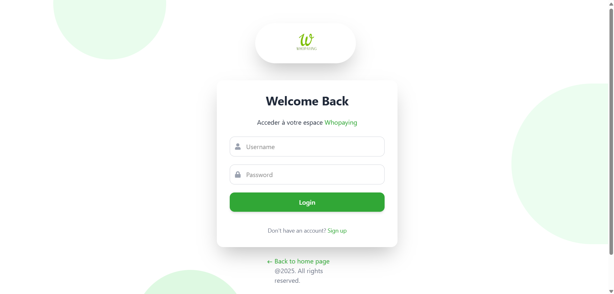
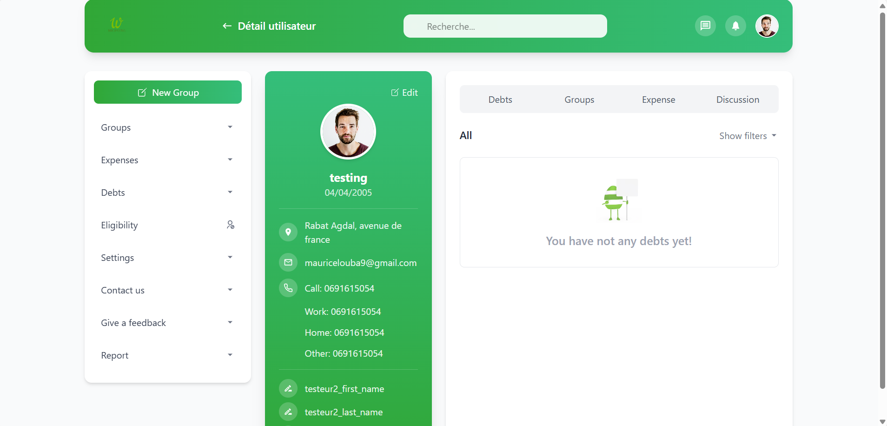
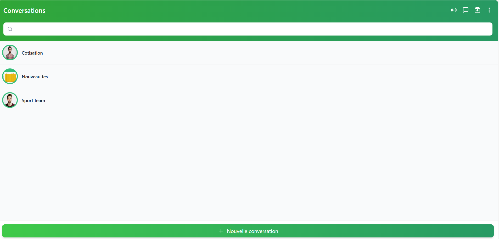

# 💸 Whopaying – Gestion de dépenses en groupe

Whopaying est une application web collaborative qui permet à plusieurs utilisateurs de suivre, partager et équilibrer leurs dépenses communes en temps réel.  
Une messagerie est également intégrée pour faciliter la communication entre les membres.


---

## 🚀 Fonctionnalités principales

- ✅ Création de groupes de dépenses
- ✅ Ajout de transactions partagées
- ✅ Calcul automatique des soldes entre membres
- ✅ Messagerie instantanée intégrée (via Django)
- ✅ Authentification sécurisée par JWT

---

## 📸 Aperçu de l'application

###  login page


### 🖼️ Page d'accueil


### 💬 Messagerie en temps réel



---

## 🛠️ Technologies utilisées

- **Frontend** : React.js, TailwindCSS
- **Backend** : Django & Django REST Framework
- **Auth** : JWT (via `djoser + simplejwt`)
- **Chat** : Canal WebSocket Django (ou API selon implémentation)
- **Base de données** : SQLite (dev) / PostgreSQL (prod)
- **Déploiement** : Render

---

## 🧪 Lancer en local

```bash
# Cloner le dépôt
git clone https://github.com/tonusername/whopaying.git
cd whopaying

# Lancer le backend
cd backend
pip install -r requirements.txt
python manage.py runserver

# Lancer le frontend
cd ../frontend
npm install
npm run dev
